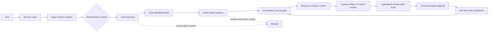

# Matterhorn Desks Agent Architecture v2

## Decision

Matterhorn Desks uses one shared session orchestrator and seven managed desk
agents. A typed capability manifest is the source of truth for each desk's
tools, context, execution boundary, model policy, verification rules, and
reader-facing capability labels.

The model may interpret intent, plan, explain, and choose from an exact
allowlist. Deterministic application and server code owns permissions, writes,
signing boundaries, transaction submission, receipts, and completion claims.



## Runtime Shape

### Shared orchestrator

The general Matterhorn agent coordinates project work and routes specialist
requests to the correct desk. It is intentionally broader than a managed desk,
but it inherits the same safety rule: it cannot sign, broadcast, or claim a
financial action completed without evidence.

### Managed desks

Each managed desk has:

- one stable desk and agent id;
- one workflow and output namespace;
- an exact Work tool allowlist;
- a narrower Discuss and Plan allowlist;
- deny-by-default task, web fetch, and web search permissions;
- a bounded context policy;
- a completion surface owned by the user;
- evidence and receipt requirements;
- a model and reasoning policy;
- a maximum tool-call budget; and
- prohibited claims checked independently of the model prompt.

The authoritative contract is
`packages/types/src/desk-agents.ts`. Generated OpenCode agent files under
`.opencode/agents/` are build artifacts, not a second source of truth.

## Capability Matrix

| Desk | Agent scope | Work tools | User completion | Evidence rule |
| --- | --- | --- | --- | --- |
| Bittensor | Public TAO, SS58, subnet, validator, wallet reads, staking previews | One bounded Bittensor desk call | External Bittensor signer | Live source and freshness; receipt required for completion |
| Hyperliquid | Markets, orderbooks, funding, exposure, open orders, previews | Exact read tools plus order preview | Separate manual trade ticket with connected-wallet intent | Live source and freshness; submission receipt required |
| Polymarket | Market discovery, liquidity, compliance, preview, handoff | Search, compliance, preview, handoff | Eligible external Polymarket client | Compliance evidence and receipt for any completion claim |
| Sui | Public balance and transfer preview | Balance read and transfer preview | Connected Sui wallet, or external handoff where direct connect is unavailable | Tool-backed preview; wallet receipt required |
| Longevity | Educational program and deliverable workflow | Workflow catalog, templates, prompt pack, scoped file reads and writes | Saved project deliverables | Successful workspace write |
| Memory | Explicit memory review, save, edit, forget, and export | Exact memory CRUD and export tools | User confirmation in the Memory surface | Memory tool confirmation and provenance |
| MCPs | Runtime inspection and client-specific MCP configuration | Status, capabilities, workflow catalog, scoped file reads and writes | Local client configuration | Runtime readiness and successful file write |

## Execution Boundaries

The following invariants apply to every desk:

1. Agents do not hold private keys, seed phrases, raw signatures, API secrets,
   signed payloads, or wallet exports.
2. Agents, watches, and automations do not sign, submit, or broadcast.
3. A preview, draft, or handoff is never described as a completed action.
4. Live claims name their tool-backed source and freshness.
5. A completion claim requires the receipt type defined by the desk contract.
6. Tool access is denied unless the exact tool name appears in the selected
   desk and mode allowlist.

Hyperliquid is the only launch capability with an in-product submission path.
Chat creates a non-submittable preview. The user must open a separate manual
trade ticket, review the exact order, sign a short-lived intent with a connected
wallet, and approve one submission. The server feature gate, intent expiry,
one-time use, chain checks, and receipt handling remain deterministic.

Bittensor, Polymarket, and Sui keep their respective external signer, external
client, or connected-wallet completion boundaries. These differences are
product capabilities, not wording variations.

## Context Assembly

The session system context is assembled from typed blocks in a stable order:

1. execution mode;
2. selected desk contract;
3. direct-response guidance;
4. environment variable names, never values;
5. public wallet context when the desk permits it;
6. crypto safety policy when relevant;
7. workspace orientation;
8. active workflow; and
9. selected response perspective.

The compiler:

- accepts only known block ids;
- uses the first instance of a duplicate id;
- applies per-block and total character limits;
- records when content is omitted;
- excludes signing material and secret values; and
- includes memory only when it was explicitly selected for the session.

Implementation:
`apps/app/src/react-app/domains/session/context/session-system-context.ts`.

## Model Policy

Users may choose a model, with the workspace fallback used when no local choice
exists. Managed desks default to balanced reasoning, low temperature, and
required tool calling. A stronger model does not receive broader permissions:
the contract and deterministic runtime remain the authority.

Model quality is evaluated on:

- correct desk routing;
- exact tool selection;
- abstention when evidence is unavailable;
- source and freshness disclosure;
- no unsupported action or completion claims;
- concise, user-facing answers without exposed internal reasoning; and
- correct transition to the user-owned completion surface.

## Verification

`evaluateMatterhornDeskResponseEvidence` rejects or flags:

- agent signing claims;
- agent submission claims;
- automation submission claims;
- completion without a receipt;
- live facts without tool evidence;
- live facts without a named source or freshness; and
- tool-call budget overruns.

This complements, but does not replace, server-side authorization, route
validation, feature gates, transaction simulation, intent verification, and
receipt checks.

## Generated-Agent Lifecycle

`apps/server/src/workspace-init.ts` renders managed `.opencode/agents` files
from the typed manifest. Startup or workspace initialization refreshes managed
files when the contract changes while preserving workspace-owned custom files
and the bespoke general orchestrator.

Contract tests ensure that:

- generated files contain the v2 marker;
- managed agents deny unspecified tools;
- Work and read-only modes match the manifest;
- every allowlisted Matterhorn MCP tool is registered by the MCP server;
- product labels come from the same capability policy; and
- generated files remain synchronized with the contract.

## Product Labels

UI status and summary copy is derived from the same manifest used by the
runtime. The launch labels are:

- Bittensor: **Prepare only**
- Hyperliquid: **Review & submit**
- Polymarket: **Prepare only**
- Sui: **Review in wallet**
- Longevity: **Workspace workflow**
- Memory: **User-confirmed**
- MCPs: **Configure**

These labels describe capability. They are not action buttons.

## Operational Tests

Run the architecture and launch checks in this order:

```bash
pnpm typecheck
bun test apps/app/tests/desk-agent-architecture.test.ts apps/app/tests/execution-mode-contract.test.ts apps/server/src/workspace-init.test.ts
pnpm test:matterhorn-desk-agent-contract
pnpm test:desk-action-manifest
pnpm test:matterhorn-workflow-contract
pnpm test:protocol-desk-visual-contract
pnpm test:market-execution-safety-gate
pnpm test:market-execution-chain-gate
pnpm test:hyperliquid-read-preview-qa
pnpm test:hyperliquid-readiness-gate
pnpm test:matterhorn-platform-safety
```

Live wallet approval, external signers, production OAuth, and real transaction
submission require owner-controlled test accounts and assets. Automated gates
must not manufacture evidence for those paths.

## Source Map

- Typed desk contracts: `packages/types/src/desk-agents.ts`
- Mode-specific tool policy: `packages/types/src/execution-mode.ts`
- Action catalog: `packages/types/src/desk-actions.ts`
- Workflow truth: `packages/types/src/matterhorn-workflows.ts`
- Context compiler: `apps/app/src/react-app/domains/session/context/session-system-context.ts`
- Session integration: `apps/app/src/react-app/shell/session-route.tsx`
- Product labels: `apps/app/src/react-app/domains/session/workflows/protocol-desk-ui.ts`
- Agent generation: `apps/server/src/workspace-init.ts`
- MCP registrations: `packages/matterhorn-work-mcp/index.mjs`
- Architecture tests: `apps/app/tests/desk-agent-architecture.test.ts`
- Contract gate: `scripts/matterhorn-desk-agent-contract.test.mjs`
