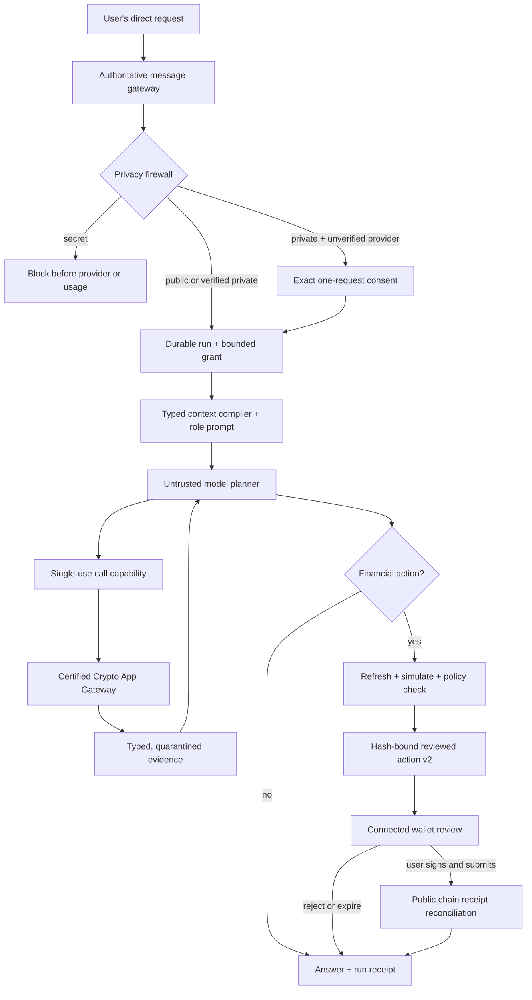

# Matterhorn Guarded Agent Architecture v3

**Status:** Current implementation guide  
**Runtime compatibility:** OpenWork `v0.18.42`, OpenCode `v1.18.27`  
**Release posture:** Built behind fail-closed flags; live Phase 1–5 acceptance is still `NO-GO` until operator-controlled evidence passes

## The decision

Matterhorn treats every model as an untrusted planner. A model may understand a
request, choose from a narrow list of approved actions, summarize evidence, and
prepare a proposed transaction. It cannot decide what private data may leave
Matterhorn, grant itself access, create its own authority, sign, relay,
broadcast, or submit a transaction.

Matterhorn's deterministic server is the authority for:

- privacy classification and one-request consent;
- coworker, workspace, app, file, Memory, and wallet access;
- tool and network authorization;
- transaction terms, limits, simulation, expiry, and review;
- connected-wallet-only signing and submission;
- evidence provenance, receipts, retention, and tenant deletion; and
- rollout from `off` to `shadow` to `enforce`.

This boundary applies equally to the web app, direct account APIs, OpenCode,
MCP clients, scheduled coworker watches, and certified third-party crypto apps.
The UI is not the security boundary.

## One guarded path



There is no alternate model-visible submit path. Deprecated submit tool names
must fail closed without network traffic.

## Security planes

### 1. User and coworker plane

Users work in chat with persistent coworkers rather than configuring raw agent
infrastructure. Each coworker has a stable role, mission, lifecycle, limits,
allowed apps, selected resources, structured working state, watches, and inbox.

The initial roles are:

| Coworker | What it may do | Financial boundary |
| --- | --- | --- |
| Market Analyst | Read and compare current certified evidence | Cannot prepare transactions |
| Risk Monitor | Watch approved public/private signals and raise bounded alerts | Cannot prepare transactions |
| Transaction Coordinator | Research and prepare one exact action from the current request | Ends at connected-wallet review |
| Treasury Coworker | Track approved structured state and prepare supported testnet transfers | Ends at connected-wallet review |

Coworker prose is data, not policy. Server-owned role prompts and grants define
authority. A coworker cannot broaden its own apps, files, Memory, network,
budget, role, or transaction scope. A scheduled watch has read authority only
and cannot turn an alert into a financial action.

Persistent state is deliberately structured: decisions, observed positions,
unresolved risks, pending wallet-review hashes, evidence references, and
explicitly approved Memory IDs. Matterhorn does not replay an unrestricted
transcript as durable agent memory.

### 2. Privacy and model plane

All account-facing inference uses:

- `POST /workspace/:id/sessions/:sessionId/messages/preflight`
- `POST /workspace/:id/privacy-consents/:challengeId/confirm`
- `POST /workspace/:id/sessions/:sessionId/messages`
- `POST /workspace/:id/sessions/:sessionId/compact`

Before usage reservation, run creation, OpenCode dispatch, or provider contact,
Matterhorn hashes and classifies the exact provider-bound request: user parts,
server context, stored history, selected agent instructions, hidden compaction
instructions, attachment bytes, Agent File revisions, Memory revisions,
provider, model, session, and tool profile.

Data uses five labels:

| Label | Examples | Default handling |
| --- | --- | --- |
| `public` | Chain state, public market data, public research | May use a disclosed provider |
| `workspace_private` | Files, selected Memory, project context | Verified/private provider or exact consent |
| `wallet_private` | Account-linked address, balances, positions, trade intent | Transaction/private handling; never silently downgraded |
| `secret` | Seed phrase, private key, API credential, wallet export, raw signature | Always blocked; never consentable |
| `untrusted_external` | App, chain, webpage, MCP, token, or governance output | Quarantined data; never instructions or authority |

Consent is valid for five minutes, single-use, and bound to the exact request.
Changing one byte, context revision, provider, model, agent, session, app, tool
profile, or selected resource invalidates it.

The **Private** control uses only a current server-verified Venice catalog proof.
Matterhorn admits stable, online, non-deprecated, tool-capable models that Venice
currently labels private. If the proof expires, refresh fails, or the chosen
model disappears, both UI and server fail closed. Matterhorn does not claim
E2EE or TEE for the ordinary OpenAI-compatible Venice transport; those model
classes require a separately reviewed encryption or attestation integration.

OpenCode remains the reasoning and streaming harness. It is not the privacy or
authorization authority. Matterhorn validates the exact final provider message
set at the transport boundary so a later runtime transformation cannot append
unreviewed private data.

### 3. Capability and runtime plane

When a prompt is accepted, the server creates a durable run and bounded grant.
Each crypto call then requires a short-lived HMAC capability bound to:

- `jti`, `runId`, `workspaceId`, `sessionId`, and `callId`;
- selected coworker/agent, desk, exact tool, and access class;
- canonical tool-argument hash; and
- policy and registry versions plus issue/expiry time.

Capabilities expire after 60 seconds and are consumed atomically once. Missing,
expired, replayed, cross-tenant, cross-session, wrong-run, wrong-tool, and
argument-mutated calls fail closed. A read capability cannot invoke a prepare
action. Retries receive a new call ID and capability.

The effective permission is the intersection of managed global policy,
selected desk/coworker allowlist, execution mode, server tool profile, current
run grant, certified app connection, and per-call capability. No client or model
can widen that intersection.

### 4. Certified Crypto App Gateway

The gateway is the only route from a coworker capability to a third-party
crypto app. An operator signs, tests, certifies, and promotes an exact app
manifest revision. Workspace users may then grant only selected actions,
scopes, and networks from that certified revision.

Every manifest action declares one of `read`, `watch`, `prepare`, or `simulate`.
It must declare `walletSubmissionOnly: true` and `agentMaySubmit: false`.
Financial preparation requires a simulation boundary.

Supported restricted transports are:

- Matterhorn SDK adapters;
- MCP Streamable HTTP `2025-11-25` with no dynamic discovery or server-driven
  prompts/resources/sampling/elicitation/tasks/SSE;
- JSON-RPC 2.0 with one exact method and response-bound ID; and
- OpenAPI action profiles with one signed origin and one static `POST` path per
  action.

The router pins the certified origin, resolves only public DNS, verifies the TLS
hostname and actual peer, refuses redirects, bounds time and bytes, accepts only
the signed method/path/action, and projects a closed typed result. It does not
let an adapter choose a destination, method, price, metering value, or model
instruction.

OAuth tokens, managed API keys, and wallet-control proofs stay in the server
boundary. They never enter prompts, tool results, browser storage, receipts, or
account responses. A wallet-control proof proves account ownership only; it is
not permission to spend.

The invite-only developer platform supports publisher keys, submissions,
conformance results, certification requests, and privacy-safe usage summaries.
Developer access cannot self-certify or self-promote an adapter.

### 5. Transaction airlock

The model may describe or prepare a transaction but cannot execute it. For every
supported protocol, Matterhorn independently resolves the exact action, applies
workspace limits, refreshes time-sensitive state, simulates when required, and
creates `matterhorn.reviewed-action-handoff.v2`.

The v2 hash binds the run, action, policy, protocol, network, signer, operation,
asset, amount/size, recipient/side, price/slippage, simulation reference,
preparation time, and expiry. Any material change creates a new intent and
invalidates the old review. V1 handoffs are display-only until regenerated.

| Protocol | Implemented guarded preparation | Final authority |
| --- | --- | --- |
| Sui | Testnet balance reads and dry-run native/coin/object transfer terms | Connected Sui wallet |
| Bittensor | Test/Finney public evidence and compatible transfer/stake/unstake preparation where reliable simulation and wallet support exist | Connected compatible wallet |
| Hyperliquid | Testnet markets, orderbook, exposure, and exact order preparation | Connected wallet review |
| Polymarket | Mainnet public discovery/book reads and separately certified eligibility-aware wallet preview | Connected wallet review; jurisdiction rules remain authoritative |

The connected wallet displays, signs, and submits the exact reviewed action.
Matterhorn never receives a submit capability. A receipt is accepted only when
its public chain result reconciles to the reviewed intent hash.

### 6. Evidence, Agent Files, and Walrus/Sui plane

Every run ends with a redacted `matterhorn.agent-run-receipt.v1`, including
success, partial completion, cancellation, and failure. It records provider and
privacy policy, disclosed data categories, consent, tool names/access/outcomes,
latency, source/freshness, token usage and cost estimate, explicit Memory
reads/writes, capability decisions without bearer values, and transaction
hash/simulation/public receipt fields. It excludes raw prompts, secrets,
signatures, keys, unrestricted tool output, and capability tokens.

Receipts and evidence use tenant-scoped integrity chains. User content can be
deleted; minimal content-free security metadata expires after 365 days.

Agent Files are the user-controlled data sandbox. A user selects a bounded
UTF-8 text, Markdown, CSV, or JSON file and grants it read-only to exact
coworkers. Matterhorn scans the bytes before storage and again before model use,
encrypts them with server-side envelope keys, binds every revision, and grants
zero wallet or app authority. Recovery is owner-only. Deletion destroys the
recovery key.

Walrus stores only generic AES-GCM ciphertext envelopes. Public objects contain
no plaintext, filename, tenant/coworker/wallet identity, or KMS reference.
Matterhorn verifies publication by reading the exact bytes back. Optional Sui
testnet renewal, anchoring, or deletion is prepared and simulated, then completed
only by the connected wallet. Agents never pay, renew, delete, sign, or submit.
Mainnet writes remain disabled without a separate explicit decision.

An independent recovery-erasure ledger prevents a restored old backup from
reviving a key the user destroyed. A missing, stale, or modified ledger fails
closed.

## Prompt architecture

Matterhorn uses two distinct layers:

1. **Data first:** coworker profile, structured state, explicitly selected
   Memory, and selected Agent Files, each bounded and marked as data.
2. **Authoritative policy last:** immutable common rules plus role-specific
   rules from `matterhorn.coworker-master-prompt.v4`.

Reserved control markers in data are escaped. The policy suffix is never
truncated. The compiler hashes the exact final string for privacy binding. The
master prompt is intentionally short: it teaches source/freshness discipline,
current-request-only financial intent, secret refusal, connected-wallet review,
and plain-language answer structure; deterministic code enforces the boundary.

The reviewed prompt text is documented in
[`coworker-master-prompts.md`](../crypto-coworkers/coworker-master-prompts.md).

## Token and latency architecture

Matterhorn exposes only the active coworker's approved actions to the model.
Typed projections replace unrestricted tool responses; full evidence remains
outside model context. Public block-bound evidence can be cached by app,
network, block, and query. Structured state carries decisions, risks, positions,
pending reviews, and evidence references instead of replaying entire chats.

The compiler targets bounded summaries and preserves citations, action terms,
unresolved risks, and approved private context during compaction. Usage, tool
budgets, latency, and cost estimates appear in the run receipt. The formal
acceptance target is at least 40% fewer repeated provider-reported input tokens
than the Phase 0 baseline with privacy/policy overhead below 100 ms p95 for
text-only requests. These targets require hosted evidence; local passing tests
do not prove them.

## Rollout and current readiness

The critical flags remain fail-closed:

```text
MATTERHORN_GUARDED_RUNTIME_MODE=off|shadow|enforce
MATTERHORN_CRYPTO_APP_GATEWAY_MODE=off|shadow|enforce
MATTERHORN_COWORKER_MODE=off|internal|invite|public
MATTERHORN_AGENT_FILES_MODE=off|encrypted
MATTERHORN_WALRUS_EVIDENCE_MODE=off|testnet|mainnet
```

Code and local contracts do not authorize production activation. The current
live Phase 1–5 gate stays `NO-GO` until operator-controlled sealed adapter
certification, Sui and Hyperliquid financial probes, Polymarket jurisdiction and
wallet-preview evidence, two-account hosted isolation, provider/privacy flows,
wallet reject/expire/tamper/approve cases, and exact-release acceptance all pass.

Rollout order is `off` → invite-only `shadow` → prepare enforcement → read
enforcement, one protocol at a time. Shadow records decisions but never weakens
an existing denial. One switch returns the runtime to the existing safe wallet
handoff behavior.

## Authoritative source map

| Concern | Primary implementation |
| --- | --- |
| Public contracts | `packages/types/src/crypto-coworkers.ts`, `packages/types/src/guarded-agent-runtime.ts`, `packages/types/src/reviewed-actions.ts` |
| Message/privacy gateway | `apps/server/src/server.ts`, `apps/server/src/agent-privacy.ts`, `apps/server/src/guarded-agent-runtime.ts`, `apps/server/src/opencode-plugins/matterhorn-guard.ts` |
| Venice private models | `apps/server/src/venice-provider.ts`, `apps/server/src/provider-privacy.ts` |
| Capability broker and runs | `apps/server/src/agent-capability.ts`, `apps/server/src/guarded-agent-runtime.ts` |
| Coworker prompt and context | `apps/server/src/crypto-coworker-master-prompt.ts`, `apps/server/src/crypto-coworker-context-compiler.ts` |
| Persistent coworkers | `apps/server/src/crypto-coworker-store.ts`, `apps/server/src/crypto-coworker-runtime.ts` |
| Certified app gateway | `apps/server/src/crypto-app-registry.ts`, `apps/server/src/crypto-app-adapter-router.ts`, `apps/server/src/crypto-app-guarded-authorization.ts` |
| Transport profiles | `apps/server/src/crypto-app-mcp-http-transport.ts`, `apps/server/src/crypto-app-json-rpc-transport.ts`, `apps/server/src/crypto-app-openapi-transport.ts`, `apps/server/src/crypto-app-http2-grpc-fetch.ts` |
| First-party protocol contracts | `apps/server/src/first-party-crypto-apps.ts`, `apps/server/src/first-party-crypto-app-executor.ts` |
| Transaction airlock | `apps/server/src/reviewed-action-airlock.ts`, `apps/server/src/reviewed-action-refresh.ts`, `apps/server/src/reviewed-action-protocol-refresh.ts` |
| Receipts and evidence | `apps/server/src/agent-run-receipts.ts`, `apps/server/src/crypto-evidence-store.ts`, `apps/server/src/crypto-evidence-finalizer.ts` |
| Agent Files and Walrus | `apps/server/src/agent-file-boundary.ts`, `apps/server/src/agent-file-store.ts`, `apps/server/src/walrus-storage.ts`, `apps/server/src/agent-file-walrus-runtime.ts` |
| User surfaces | `apps/app/src/react-app/domains/coworkers/`, `apps/app/src/react-app/domains/agent-files/`, `apps/app/src/react-app/domains/crypto-apps/`, `apps/app/src/react-app/domains/wallet/` |
| Release acceptance | `docs/crypto-coworkers/acceptance-evidence.md`, `scripts/crypto-coworkers-acceptance-evidence.mjs` |

The comprehensive delivery status and remaining operator work live in
[`phases-1-5-plan.md`](../crypto-coworkers/phases-1-5-plan.md). Source code and
automated contracts take precedence over this guide if they ever disagree.
