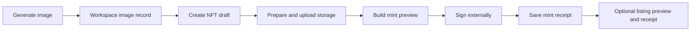

# Outputs And Generated Media

Outputs are workspace-owned artifacts produced by chats, desks, and workflows. Generated media is one producer of outputs; the Outputs rail is the common place to inspect images, documents, previews, receipts, and structured evidence.

## Outputs UX

The rail follows a list-to-detail flow:

1. Browse or filter output summaries.
2. Open one item in a dedicated detail view.
3. Use an explicit Back action to return to the list.
4. Keep primary actions in the header rather than above raw content.

Structured JSON receipts render a readable summary first. The exact JSON remains available under **Raw receipt data** for audit and debugging. Long identifiers wrap or truncate with access to the full value; they must not force the rail wider than its container.

Output deletion is workspace-scoped and restricted to valid files below `outputs/`. Directory deletion and traversal outside the output root are rejected.

## Image And NFT Lifecycle



Mint and listing previews are unsigned plans. Matterhorn does not mint, list, or sign on the user's behalf. Public transaction receipts are saved after the external wallet flow.

## Generated-Media Routes

| Area | Routes |
| --- | --- |
| Diagnostics | `GET /workspace/:id/generated-media/diagnostics`, `GET /workspace/:id/generated-media/diagnostics/report` |
| Images | `GET /workspace/:id/images`, `POST /workspace/:id/images/generate`, item read/file/delete routes |
| History | `GET /workspace/:id/generated-media/history` |
| NFT drafts | Create from an image; list, read, update, and delete workspace drafts. |
| Storage | Prepare and upload draft media and metadata. |
| Mint | Create an unsigned preview and record a public receipt. |
| Listing | Create an unsigned listing preview and record a public receipt. |

Generated-media readiness is visible in Settings. Provider credentials and diagnostics belong there; generated artifacts belong in Outputs.

Customer-facing readiness labels use **Platform setup** for the production image provider, Walrus endpoints, and Sui package identifiers. Those are Matterhorn deployment responsibilities, not end-user tasks. Exact environment keys remain available only under the progressive **Platform setup details** disclosure. A Sui wallet connection is different: that is an explicit user action and must be labelled **Connect wallet**.

## Production Readiness

Local mock image generation is test-only. Production end-to-end media requires all of the following backend-owned configuration before the UI may describe public publishing as ready:

- `MATTERHORN_IMAGE_PROVIDER=openai` and an `OPENAI_API_KEY` stored in Matterhorn environment settings;
- `MATTERHORN_WALRUS_PUBLISHER_URL` and `MATTERHORN_WALRUS_RELAY_URL`;
- a positive `MATTERHORN_WALRUS_STORAGE_EPOCHS`;
- `MATTERHORN_SUI_NFT_PACKAGE_ID` for unsigned mint previews;
- `MATTERHORN_SUI_KIOSK_PACKAGE_ID` and `MATTERHORN_SUI_TRANSFER_POLICY_PACKAGE_ID` for unsigned listing previews;
- a real Sui wallet for explicit user signing. Diagnostics never sign, submit, or write public data.

Verify the deployed backend with:

```bash
node scripts/generated-media-production-readiness.mjs --require-production \
  --server-url <backend-url> --token <client-token> --workspace-id <workspace-id> --json
```

Billing allowance errors return only genuinely higher eligible plans. A Free allowance limit may recommend Matterhorn Plus or Matterhorn Max, never Free. If no higher plan exists, the UI directs the user to wait for the allowance reset instead of showing an impossible upgrade. Historical workspaces that exceed a newly introduced limit use `N used; Plan includes M per allowance period` rather than the misleading `N of M` form. Activity for an entitlement that is not included on the current plan is labelled historical; it is not presented as current-plan consumption.

## Storage And Evidence

Generated-media records and receipts live under the workspace `.matterhorn-work` data boundary. Output descriptors carry enough metadata for readable summaries, linked artifacts, and audit trails without exposing signing material.

## Source And Verification

- Generated-media server routes: `apps/server/src/generated-media-routes.ts`
- Client API: `apps/app/src/app/lib/matterhorn-server.ts`
- Output list: `apps/app/src/react-app/domains/session/artifacts/output-list.tsx`
- Receipt presentation: `apps/app/src/react-app/domains/session/artifacts/output-receipts.ts`
- Media history: `apps/app/src/react-app/domains/session/media/generated-media-history.tsx`

```bash
pnpm --filter matterhorn-work-server exec bun test src/generated-media-routes.e2e.test.ts
pnpm --filter @matterhorn-work/app exec bun test \
  tests/outputs-panel-contract.test.ts \
  tests/image-generation-ui-contract.test.ts
```
