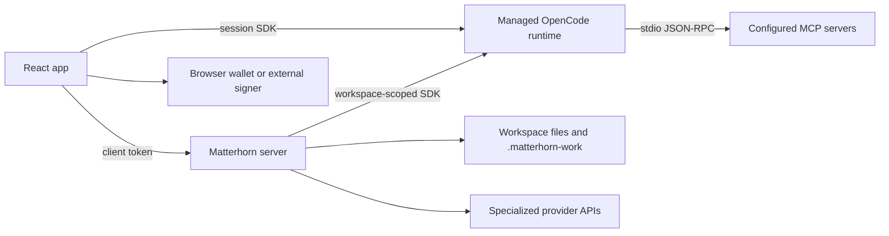

# Matterhorn Work Platform Architecture

**Status:** Current implementation guide
**Updated:** 2026-07-11

## System Overview

Matterhorn Work is a local-first workspace with four primary runtime layers:

1. **React app:** customer UI, routing, session surfaces, settings, wallet controls, Notes, Memory, and Outputs.
2. **Matterhorn server:** workspace-scoped API, authorization, approvals, data policy, storage, billing, wallet policy, generated media, and audit/evidence routes.
3. **Matterhorn Work engine:** managed OpenCode runtime for normal chat, tool execution, permissions, model/provider discovery, and session state.
4. **Desktop/local perimeter:** Electron trusted IPC, orchestrator processes, MCP stdio servers, and the token-protected local router.



## Normal Chat Path

Normal chat is not a direct one-shot LLM call.

1. The app creates or selects an OpenCode-backed session.
2. Matterhorn assembles workspace, wallet, product-orientation, protocol, and response-perspective system context.
3. The app submits through the session prompt API.
4. OpenCode manages model routing, streaming, tool calls, permissions, compaction, and session persistence.
5. The UI renders the session event stream and local activity state.

The user-facing name is **Matterhorn Work engine**. Use **OpenCode** only for technical compatibility, diagnostics, SDK names, `.opencode/` paths, and configuration.

## Direct Provider Paths

Specialized features may use provider-specific APIs through the Matterhorn server. Examples include:

- image generation;
- realtime voice;
- billing providers;
- public market or protocol data providers;
- configured Bittensor sidecars or subnet adapters.

These paths are capability-specific. They do not replace the normal chat harness.

## Workspace Identity

Customer routes use Matterhorn workspace IDs such as `ws_...`. The server resolves each ID to an authorized workspace root. Filesystem operations must remain inside that root.

The app may also hold an engine directory and OpenCode session ID. Those identifiers serve different layers and must not be treated as interchangeable.

## Storage Map

| Data | Primary owner | Storage |
| --- | --- | --- |
| Chat sessions and message/tool state | Matterhorn Work engine | OpenCode runtime store |
| Project Notes | Matterhorn server | `notes/YYYY-MM-DD.md` plus `.matterhorn-work/notes/index.json` |
| Memory records and suggestions | Memory vault | workspace-scoped vault paths and metadata |
| Outputs and receipts | Workspace/server | `outputs/` and `.matterhorn-work/outputs/` depending on output class |
| Wallet safety policy | Matterhorn server | `.matterhorn-work/wallet/safety-policy.json` |
| Wallet safety events | App + server ledger | local runtime log plus workspace project-data ledger |
| Billing state | Matterhorn server | workspace billing store; Stripe state only after verified events |
| MCP configuration | OpenCode config | project/global `opencode.json` or `opencode.jsonc` |
| Audit and project evidence | Matterhorn server | append-oriented workspace audit/task/evidence stores |

The backend data-map and data-control routes describe these stores without exposing tokens, private keys, or unrelated filesystem paths.

## Authorization And Trust Boundaries

The server uses scoped bearer tokens:

- **viewer:** read-only workspace inspection;
- **collaborator:** workspace mutations such as Notes, Memory actions, wallet policy, and MCP config;
- **host token:** trusted host operations and approval handling.

Mutation routes also enforce server read-only mode. Sensitive actions use approval records where required.

Local services default to loopback-only CORS. Wildcard CORS is a deliberate development override, not the production default.

## Wallet Boundary

Matterhorn prepares and reviews actions; it does not become the wallet.

- EVM connection uses supported browser connectors when available.
- Sui uses wallet-standard connections through Mysten dApp Kit.
- Bittensor writes require an external Bittensor-compatible signer.
- Hyperliquid and Polymarket customer flows remain read/preview/handoff oriented.
- Workspace policy enforces per-transaction limits, daily limits, slippage limits, network preference, and mainnet enablement before submission.
- The safety ledger stores sanitized reviewed-vs-submitted evidence, not raw calldata or signing material.

## MCP Boundary

There are two related but different MCP concepts:

1. **Configured runtime MCP servers:** entries in OpenCode config with live status such as `connected`, `failed`, `needs_auth`, or `disabled`.
2. **Matterhorn MCP product catalog:** installable Bittensor, Hyperliquid, Polymarket, Memory, Workflow, Evidence, Core Agent, and UI-control profiles shown in Settings.

A connected runtime status means OpenCode completed MCP initialization and can list tools. It does not prove that a browser wallet, OAuth account, paid provider, or every upstream API is available.

## Failure Isolation

- Route and panel error boundaries prevent one failing surface from blanking the app.
- User-facing errors are sanitized; raw stacks and secrets stay in redacted diagnostics.
- Backend calls use bounded body sizes and timeouts where the capability requires them.
- Healthy readiness states remain visually quiet; setup, degraded, warning, and blocked states are actionable.

## Source Pointers

- App shell: `apps/app/src/react-app/shell/`
- Session/chat: `apps/app/src/react-app/domains/session/`
- Settings: `apps/app/src/react-app/domains/settings/`
- Server routes: `apps/server/src/server.ts`
- Notes store: `apps/server/src/notes.ts`
- Memory vault: `packages/matterhorn-memory-vault/`
- MCP connection store: `apps/app/src/react-app/domains/connections/store.ts`
- OpenCode client boundary: `apps/app/src/app/lib/opencode.ts`
- Platform safety gate: `scripts/matterhorn-platform-safety-gate.mjs`

## Verification

```bash
pnpm --filter @matterhorn-work/app exec tsc -p tsconfig.json --noEmit
pnpm --filter matterhorn-work-server exec tsc -p tsconfig.json --noEmit
pnpm test:matterhorn-platform-safety
```
