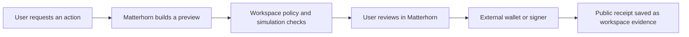

# Wallet And Signing

Matterhorn Wallet is a workspace-scoped connection, preview, and evidence surface. It supports EVM wallet connectors and Sui Wallet Standard integrations while keeping signing in the user's wallet or external signer.

## Product Model

- EVM connectors include MetaMask, Coinbase Wallet, and injected browser wallets when available.
- Sui appears as a wallet integration, not as a separate workflow the user must understand before connecting.
- Bittensor uses public SS58 address reads and external-signer handoffs. It does not share EVM custody assumptions.
- Healthy connection and policy states stay quiet. Explanations and safety detail sit behind information affordances or progressive disclosure.

Matterhorn never requests or stores seed phrases, private keys, mnemonics, wallet exports, raw signatures, signed payloads, or wallet API secrets.

## Reviewed Action Flow



A preview is not a transaction submission. Matterhorn records public evidence and safety events around the handoff, but the wallet remains the authority for user approval and signing.

## Workspace Safety Policy

The server exposes workspace-scoped policy and audit routes:

| Method | Route | Purpose |
| --- | --- | --- |
| `GET` | `/workspace/:id/wallet/safety-policy` | Read the active workspace policy. |
| `PATCH` | `/workspace/:id/wallet/safety-policy` | Update allowed limits and network policy. |
| `POST` | `/workspace/:id/wallet/safety-events` | Record validated wallet safety events. |
| `POST` | `/workspace/:id/wallet/simulate-transaction` | Run the server-side transaction safety simulation path. |
| `POST` | `/workspace/:id/sui/transactions/preview` | Prepare a Sui transaction preview. |
| `POST` | `/workspace/:id/sui/transactions/receipt` | Save public Sui receipt evidence. |

Write routes enforce workspace role and read-only-mode restrictions. Secret-like fields are rejected rather than persisted.

## Source And Verification

- Wallet rail: `apps/app/src/react-app/domains/wallet/WalletPanel.tsx`
- Sui integration: `apps/app/src/react-app/domains/wallet/sui-workflow-panel.tsx`
- Reviewed EVM sends: `apps/app/src/react-app/domains/wallet/lib/reviewed-wallet-send.ts`
- Server routes: `apps/server/src/server.ts`
- Readiness contract: `docs/contracts/wallet-profile-mcp-readiness-contract.md`

```bash
pnpm --filter matterhorn-work-server exec bun test \
  src/wallet-safety-policy-routes.e2e.test.ts \
  src/transaction-simulation-safety.test.ts
```
